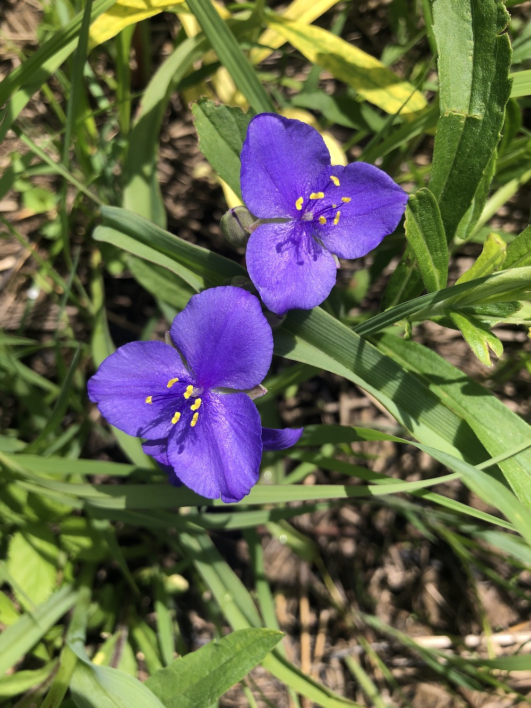
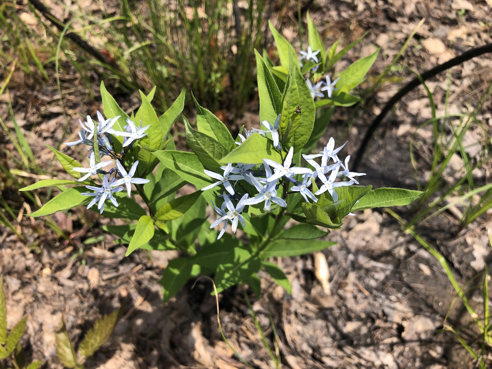
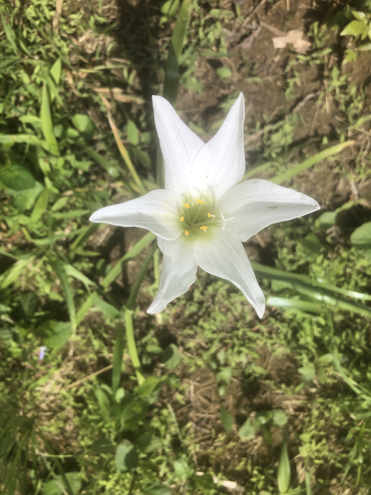
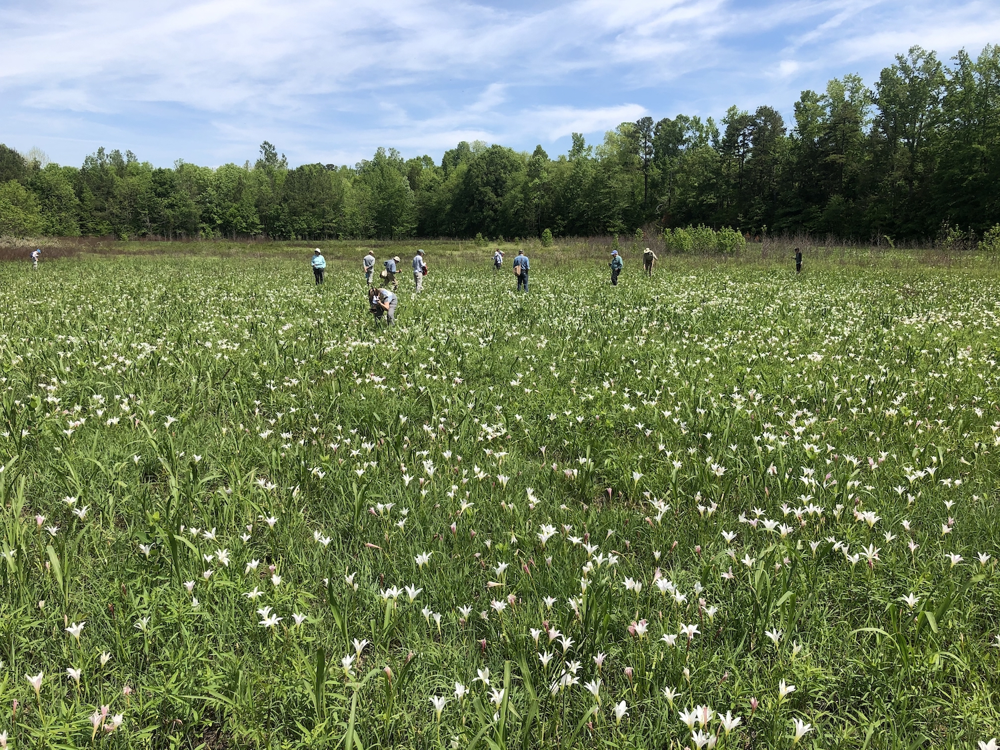
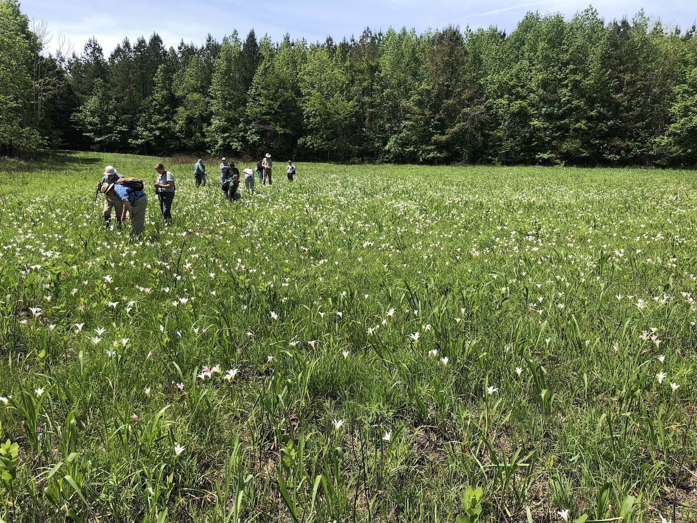
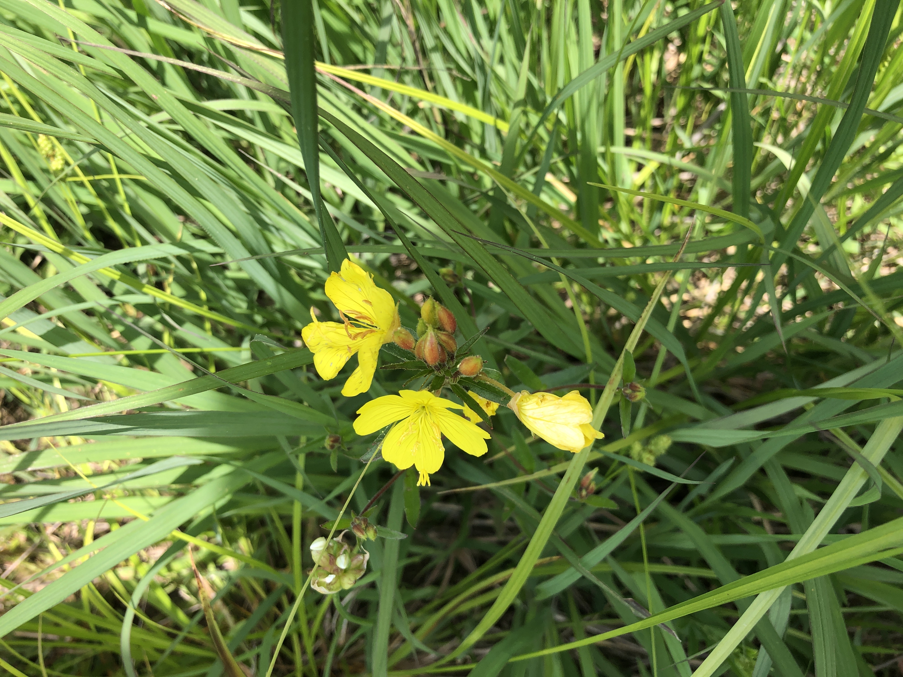
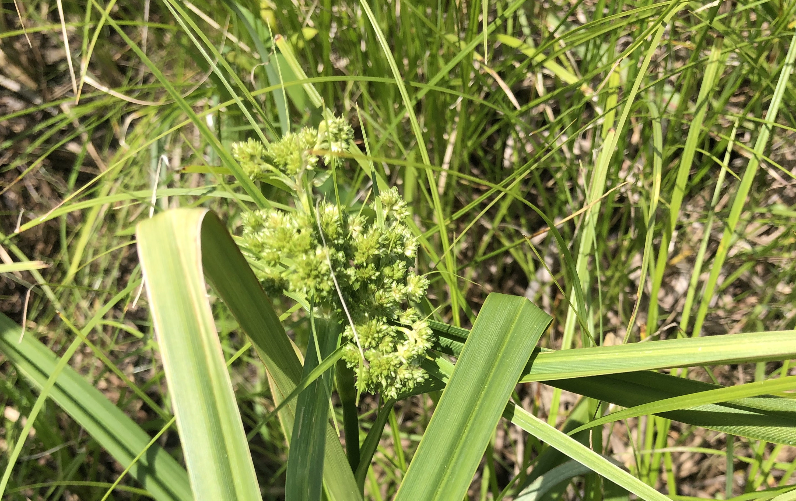
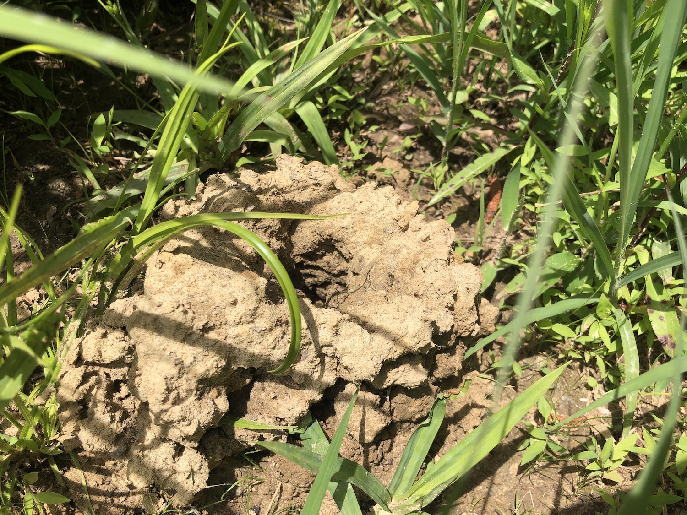

Last month, I finally had the privilege to visit [Suther prairie](https://www.ncplantfriends.org/suther_prairie.html) in Cabarrus county, North Carolina as part of a [NC Botanical Garden](https://ncbg.unc.edu/) field trip. I had been wanting to visit this site since learning about it a few years ago from [Tompkins et al](https://doi.org/10.2179/09-041.1) paper on the flora of the site. Until recently acquired by the state, this site has been held by the same family since the 1700s and not been plowed in all those years. The site is thought to be one of the best examples of what a (wetter) Piedmont prairie may have resembles 300-400 years ago.

I've shared a few images from the day below.

<figure>

 <figcaption>
    A panoramic view of the site
 </figcaption>
</figure>

<figure>

 <figcaption>
    Spiderwort
 </figcaption>
</figure>

<figure>

 <figcaption>
    an Amsonia species in bloom
 </figcaption>
</figure>

<figure>

 <figcaption>
    Atamasco lily
 </figcaption>
</figure>

<figure>

 <figcaption>
    The lilies were in full bloom.
 </figcaption>
</figure>

<figure>

 <figcaption>
    The lilies made a nice place to botanize.
 </figcaption>
</figure>

<figure>

 <figcaption>
    an Oenothera in bloom
 </figcaption>
</figure>

<figure>

 <figcaption>
    The field was full of interesting sedges.
 </figcaption>
</figure>


<figure>

 <figcaption>
    The entrance to a crayfish burrow
 </figcaption>
</figure>


<figure>

 <figcaption>
    It was my daughter Aster's first botany field trip!
 </figcaption>
</figure>

Be sure to follow [NC Botanical Garden](https://ncbg.unc.edu/) on twitter to find out about upcoming field trips and talks:

```{r, echo = FALSE}
blogdown::shortcode("tweet", "1374461480611893252")
```

